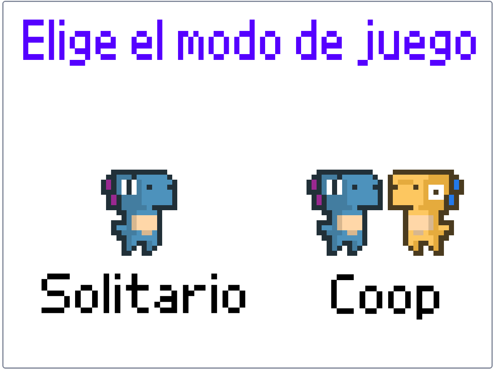
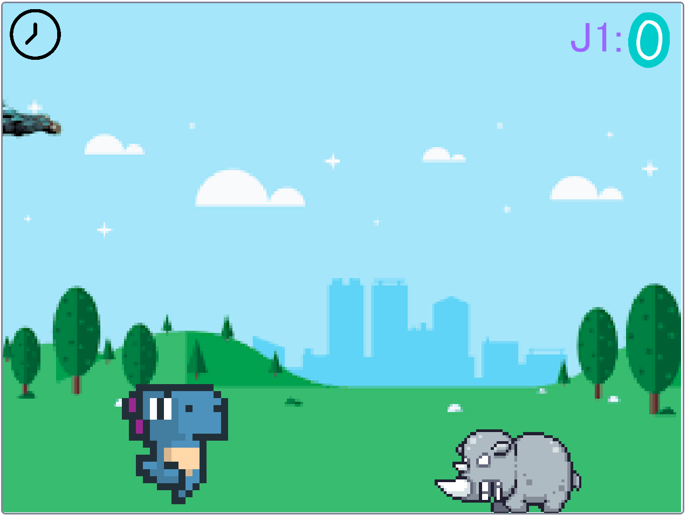
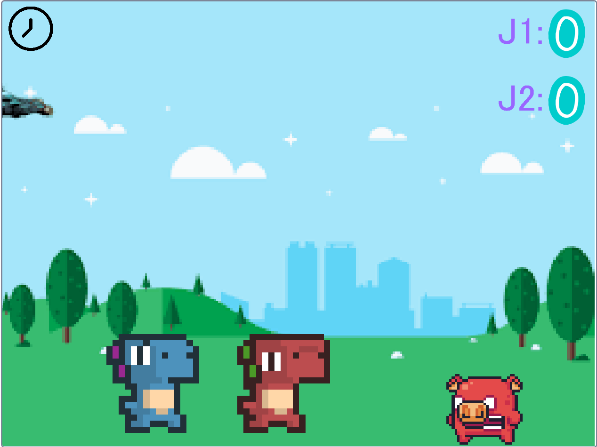
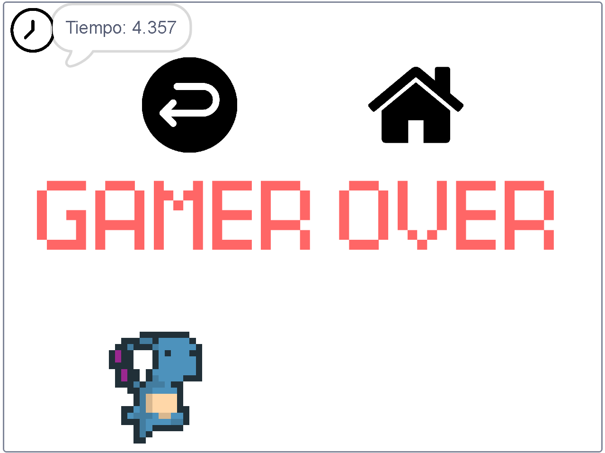

🏃 **DINO RUN** 🏃

**Descripción**  
Proyecto desarrollado en [Scratch](https://scratch.mit.edu/), una plataforma educativa para la programación visual. El objetivo del proyecto es realizar un primer acercamiento a la programacion de manera didactica 📚.

**Características**
- Desarrollo realizado en Scratch 3.0 
- Interfaz amigable para niños y jóvenes
- Lógica de programación con bloques
- Tema: Juego (Solo/Coop)

**Capturas**
- Menu del juego
 

- Menu modos de juego (Solo/Coop)
 

- Juego (Solo)
 

- Juego (Coop)

- Jueego (Coop)

- Menu GameOver
 

**Uso**
Para abrir este proyecto:
1. Ingresa a [https://scratch.mit.edu](https://scratch.mit.edu)
2. Haz clic en "Crear" y luego "Archivo → Cargar desde tu computadora"
3. Selecciona el archivo `.sb3`

**Autor**
- Jeison Alexis Rodriguez Angarita 🙍‍♂️
- Pensamiento Computacional / Ingenieria de Sistemas / Universidad de Pamplona 👨‍🎓
- 2022 🌎
